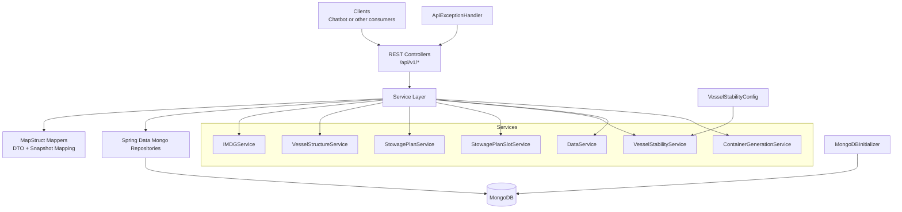
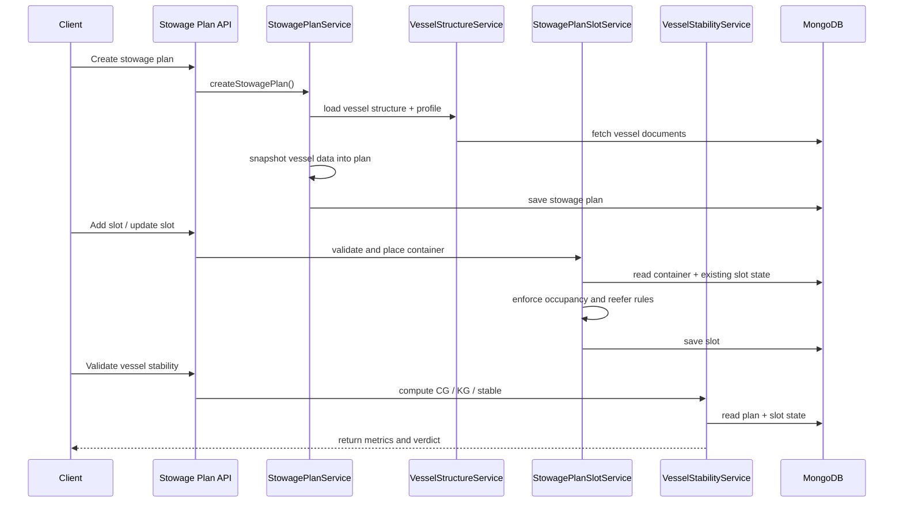

# Server Quick Architecture

## Purpose

This document gives a fast visual explanation of how the Java backend works.

The server is the authoritative domain backend. It owns structured data and planning rules for:

- IMDG reference information,
- vessel structure,
- containers,
- stowage plans,
- stowage slots,
- vessel stability.

## Diagram

## Main Runtime Model

The server follows a conventional layered Spring Boot design:

1. Controllers receive HTTP requests and return DTO-based JSON responses.
2. Services apply business rules and orchestrate domain operations.
3. Repositories read and write MongoDB documents.
4. Mappers translate between persistence entities, snapshots, and API DTOs.
5. Exception advice converts failures into consistent API error responses.

## Domain Breakdown

### IMDG domain

Serves dangerous-goods records, compatibility groups, segregation rules, segregation code dictionaries, and hazard definitions.

### Vessel domain

Serves vessel profile and vessel structure data such as bays, rows, and cells.

### Stowage domain

Creates plans, snapshots vessel data into those plans, exposes plan views, and manages slot placement.

### Stability domain

Computes CG, KG, and overall stability based on stowage-plan state and configured thresholds.

### Data operations domain

Imports seed data and generates synthetic container data for development and testing.

## Planning Flow Diagram

## Why It Is Designed This Way

- MongoDB is used because vessel and stowage data is deeply nested and document-shaped.
- Services enforce business rules so all clients see consistent behavior.
- Stowage plans store snapshots of vessel data so planning remains stable even if live vessel definitions later change.
- MapStruct reduces repetitive mapping code and keeps DTO and snapshot conversion explicit.
- Stability thresholds are configuration-driven so operational constraints can be tuned without changing calculation logic.

## What To Remember

The server is not just a data API. It is the operational core of the system:

- it owns the truth,
- it enforces planning rules,
- it calculates stability,
- it exposes domain capabilities to the chatbot and any future clients.