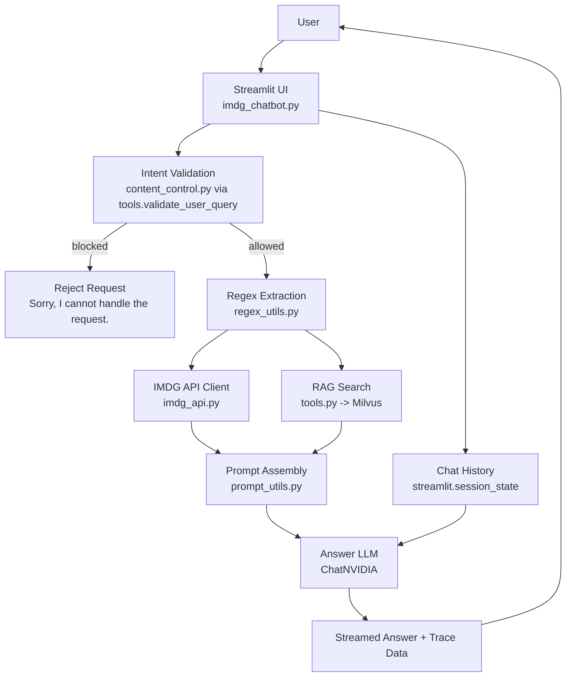

# Chatbot Quick Architecture

## Purpose

This document gives a fast visual explanation of how the chatbot works.

The chatbot is the user-facing reasoning layer. It does not own the core IMDG data model. Its job is to:

- accept the user question,
- validate whether the question is allowed,
- extract structured identifiers,
- fetch authoritative reference data,
- retrieve supporting document context,
- ask the response model to generate a grounded answer.

## Diagram

## Main Runtime Flow

1. The user sends a question in the Streamlit chat UI.
2. The chatbot runs safety and topic checks.
3. If the question is allowed, the chatbot extracts UN numbers, classes, divisions, and segregation codes from the text.
4. It queries the IMDG backend API for structured dangerous-goods data and rule definitions.
5. It queries Milvus for relevant IMDG document chunks.
6. It assembles a prompt that combines:
   - the user question,
   - API facts,
   - retrieved document text,
   - answering instructions.
7. The answer model streams a response back into the UI.
8. The UI also shows raw JSON and reference tables for transparency.

## Design View

The chatbot is intentionally organized as a controlled pipeline rather than a free-form agent.

- `imdg_chatbot.py` is the orchestration layer.
- `content_control.py` is the guardrail layer.
- `regex_utils.py` is the deterministic parsing layer.
- `imdg_api.py` and `tools.py` are the integration layer.
- `prompt_utils.py` is the prompt-construction layer.

That structure exists to keep reasoning grounded. The LLM does not decide what data to trust or which source is authoritative. The application decides that first and asks the model to explain based on the collected evidence.

## Why It Is Designed This Way

- Deterministic extraction is used before generation because IMDG identifiers have stable text formats.
- Structured backend lookup is used because factual dangerous-goods data should not depend on model memory.
- Milvus retrieval is used because reference documents contain useful explanatory context not captured in compact API records.
- Guardrails run early because the chatbot is domain-bounded and should reject unsafe or irrelevant input before spending tokens.
- The UI exposes trace data because users need to see what the answer was grounded on.

## What To Remember

The chatbot is best understood as a grounded answer composer:

- it interprets questions,
- it gathers evidence,
- it asks the LLM to explain from that evidence,
- it does not act as the source of truth itself.