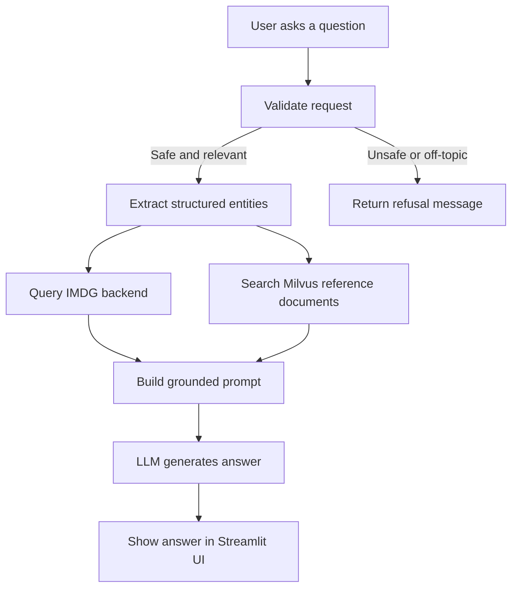

# IMDG Streamlit App

This directory contains the Streamlit-based user interface for the IMDG stowage assistant.
- The app lets users ask questions about dangerous goods segregation, compatibility, and related stowage guidance, then combines structured IMDG data, reference documents
- LLM takes the input and reasoning into a single response.

## What the app does

The UI provides a chat-style experience for questions such as:

- UN number lookups
- hazard class and division interpretation
- segregation code and segregation-group guidance
- compatibility group checks
- stowage-related rule explanations

### Dual guardrails (safety + topic) (NIM)
1. Topic control with NIM
   - Keep the conversation inside the IMDG stowage-planning domain
   - Use NVIDIA NIM-based topic control to reject off-topic requests
2. Content safety filtering with NIM
   - Prevent unsafe or disallowed requests
   - Use NVIDIA NIM-based safety checks to reject harmful instructions or abusive content
   - Block prompts that try to bypass the intended purpose of the assistant

### Deterministic parsing first, LLM second
1. Use regex to extract keyword
2. Calls backend and retrieval tools
3. Pass the collected data into the 8B model as a structured prompt
4. While 8b model could support tool calling, but internally it has quite a lot confusion, e.g.
   - using the same tools for multiple times
   - not using the correct sequence
   - not very good at multi-steps reasoning

### RAG with Milvus
1. Reference documents are embedded and retrieved to ground the model's responses in authoritative maritime guidelines.

## Performance - Async-first integration

A few design choices help keep the app responsive and reliable:

- Cache static reference dictionaries to avoid repeated backend lookups.
- Use deterministic parsing first, so the model receives cleaner and smaller inputs.
- Run safety and topic checks early to avoid unnecessary retrieval or generation.
- Keep the prompt focused by sending only the most relevant retrieved context.

The flow of the chatbot:




## Configuration

The app reads configuration from Streamlit secrets or environment variables.

Required settings:

- NVIDIA_API_KEY or Streamlit secret: [nvidia].api-key
- IMDG_SERVER_URL or Streamlit secret: [imdg-server].url
- MILVUS_URI or Streamlit secret: [milvus].uri
- MILVUS_USER or Streamlit secret: [milvus].user
- MILVUS_PASSWORD or Streamlit secret: [milvus].password

A typical Streamlit secrets file looks like this:

```toml
[nvidia]
api-key = "your-nvidia-api-key"

[imdg-server]
url = "http://your-imdg-server:8080"

[milvus]
uri = "http://localhost:19530"
user = "root"
password = "Milvus"
```

## Project files

- imdg_chatbot.py: main Streamlit app entry point and chat orchestration
- tools.py: integration layer for IMDG API, Milvus retrieval, and validation
- imdg_api.py: async client for the backend IMDG service
- content_control.py: safety and off-topic guardrails
- regex_utils.py: deterministic parsing of dangerous-goods identifiers
- prompt_utils.py: prompt construction for the answer model
- config.py: configuration loading and validation
- requirements.txt: Python dependencies
